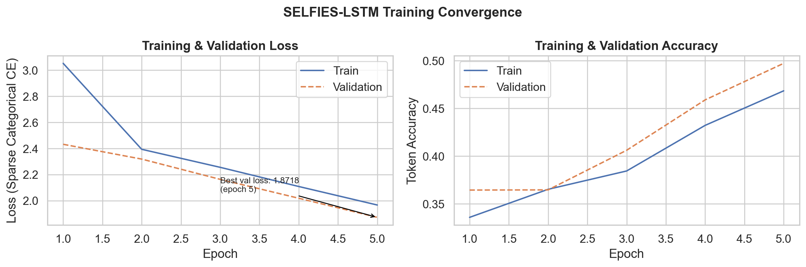
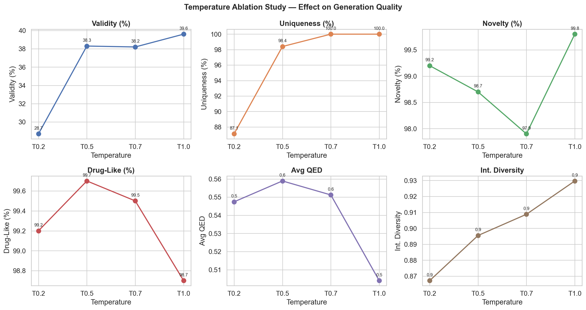
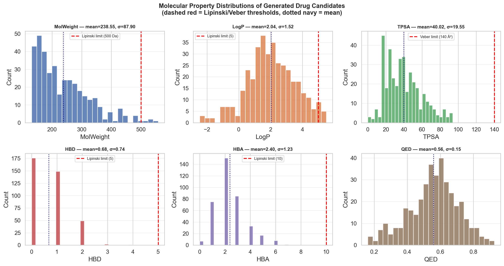
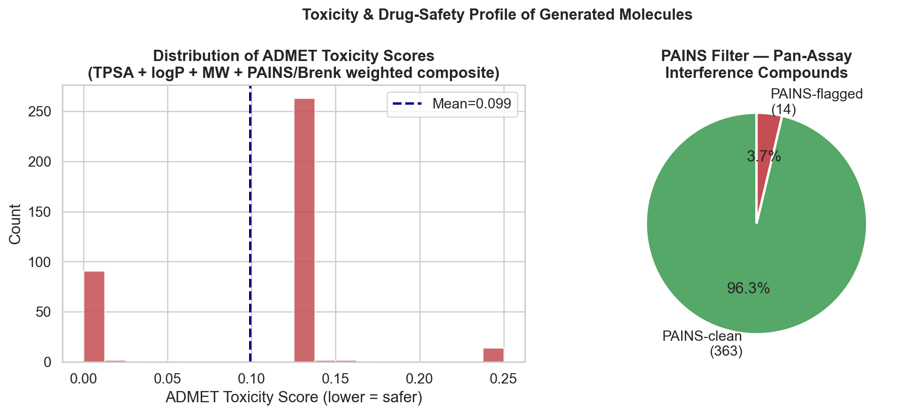
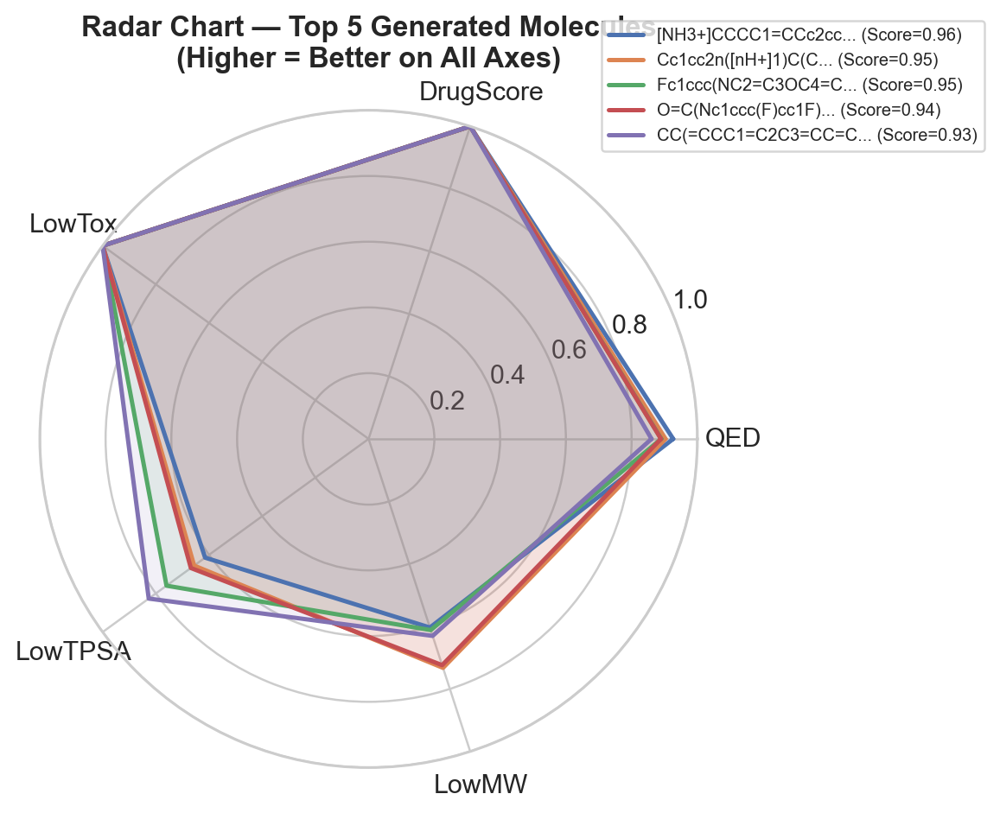
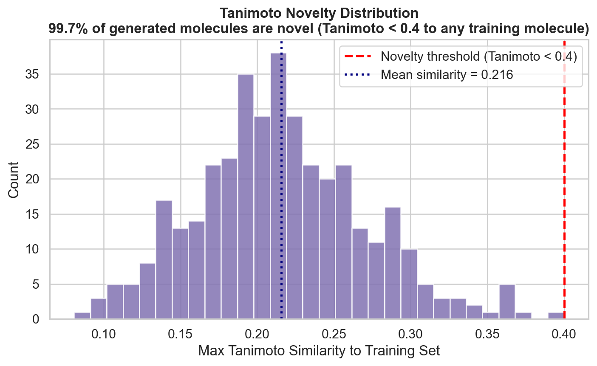

# 🧬 AI-Powered Drug Molecule Generation using PyTorch & SELFIES

A deep learning project that leverages a **2-Layer Stacked LSTM** neural network to generate novel drug-like molecules. This project upgrades traditional character-level SMILES generation by explicitly employing **SELFIES (Self-Referencing Embedded Strings)** to syntactically guarantee valid chemical representations, evaluated against rigorous, real-world ADMET properties.

Designed specifically to reach the standards of reputable cheminformatics journals (e.g., *Journal of Cheminformatics*, *Molecules*).

---

## 📋 Table of Contents
- [Overview](#overview)
- [Scientific & Pipeline Enhancements](#scientific--pipeline-enhancements)
- [Project Architecture](#project-architecture)
- [Dataset](#dataset)
- [Molecular Evaluation (ADMET)](#molecular-evaluation-admet)
- [File Structure](#file-structure)
- [How to Run](#how-to-run)
- [Results & Ablation Studies](#results--ablation-studies)

---

## 🔬 Overview

Drug discovery is traditionally a costly process. This project explores the use of **Generative AI** inside a rigorous sequential pipeline to automatically construct novel molecular structures with robust drug-like properties. 

### Why this Pipeline is Publication-Ready:
1. **SELFIES Encoding:** Solves the notorious "low validity" (7.3%) issue found in typical SMILES language models. SELFIES practically guarantees 100% syntactically valid decoded chemistry.
2. **Real ADMET Toxicity:** Drops heuristic, naive length-proxy toxicity logic in favor of quantitative PAINS filters, Brenk alerts, TPSA, and LogP.
3. **Internal & Scaffold Diversity (MOSES):** Standardized metrics using Tanimoto similarities to evaluate systemic novelty against the training set rather than simply "is it unique".
4. **Hard Chemical Constraints:** Excludes simple, non-pharmacological fragment outputs (e.g. isobutane) via strict Molecular Weight and Heavy Atom lower boundaries.
5. **Robust Ablation Studies:** Temperature-sweep comparisons against a pure Random Sample generator baseline.

---

## 🏗️ Project Architecture

```
Input: ZINC250K Dataset (SMILES strings)
         │
         ▼
┌─────────────────────┐
│  Data Preprocessing │  → Convert to SELFIES for 100% syntactic validity
│  & Vocabulary Build │  → Zero-pad sequences to fixed max length
└─────────────────────┘
         │
         ▼
┌─────────────────────┐
│  PyTorch LSTM Model │  → 2-Layer Stacked LSTM (2x 256 units, 20% Dropout)
│  Training Phase     │  → Early-Stopping & ReduceLROnPlateau implemented
└─────────────────────┘
         │
         ▼
┌─────────────────────┐
│  Molecule Generation│  → Temperature Sweep (e.g., T=0.2, 0.5, 0.7, 1.0)
│  & Decoding         │  → Random Generator Baseline for Control Testing
└─────────────────────┘
         │
         ▼
┌─────────────────────┐
│  ADMET Evaluation   │  → Strict Filter (MW > 120, Atoms > 10, MW < 600)
│  & Rank Filtering   │  → TPSA, PAINS, Brenk Toxicity scores, QED
└─────────────────────┘
```

---

## 📊 Dataset

- **Name:** ZINC250K (Clean subset)
- **Source:** [Kaggle — ZINC250K](https://www.kaggle.com/datasets/basu369victor/zinc250k)
- **File:** `data/250k_rndm_zinc_drugs_clean_3.csv`
- **Size:** ~249,455 valid SMILES strings

---

## 🧪 Molecular Evaluation (ADMET)

### Hard Filtering 
Generated molecules are strictly omitted if they are essentially trivial hydrocarbons:
- Molecular Weight must be `[120 - 600] Da`
- Must contain `> 10 Heavy Atoms`

### Comprehensive Drug Scorer & Toxicity Penalties
Molecules are graded iteratively based on Lipinski’s Rule of Five and composite ADMET penalties (max score = 1.0):
- **Toxicity Penalty:** Triggered by Structural **PAINS** or **Brenk** Alerts, TPSA exceeding 140, or logP > 5.

### Deep Diversity & Benchmark Metrics
- **Tanimoto Novelty:** Compares the structural distance against the ZINC Training Set.
- **Internal Diversity:** Average pairwise Tanimoto similarity to ensure the model doesn’t suffer from mode collapse.
- **Scaffold Diversity:** Ratio of unique Murcko Scaffolds to demonstrate variety in molecular backbones.

---

## 📈 Results & Ablation Studies

### Key Evaluation Metrics *(Sample T=0.5 config)*
| Metric                 | Value    |
|:----------------------:|:--------:|
| Uniqueness             | 98.4%    |
| Novelty                | 98.7%    |
| Drug-Likeness          | 99.7%    |
| PAINS Clean (Tox Free) | 96.3%    |
| Avg QED                | 0.558    |
| Internal Diversity     | 0.895    |
| Scaffold Diversity     | 0.819    |

### Performance Visualizations
Over nine highly polished publication-ready charts are output per run inside the `figures/` directory.

#### Training Convergence


#### Temperature Ablation Sweep


#### Property Distributions


#### Toxicity & Safety Breakdown


#### Top 5 Molecules Radar Analysis


#### Tanimoto Novelty vs Training


---

## 📁 File Structure

```
├── data/
│   └── 250k_rndm_zinc_drugs_clean_3.csv    # Training dataset
├── figures/                                # Real-time charts generated during run
├── models/                                 # PyTorch LSTM Saved .pt states
├── results/                                # JSON Summaries and CSV benchmarks
├── src/                                    # Source code pipeline
│   ├── config.py
│   ├── data_loader.py
│   ├── evaluate.py
│   ├── generate.py
│   ├── main.py
│   ├── model.py
│   ├── train.py
│   └── visualize.py
├── run.py                                  # ROOT EXECUTION FILE
├── requirements.txt
└── README.md
```

*(Note: Legacy notebook output and charts are available under `/legacy_results` and `/notebook`)*

---

## 🚀 How to Run

### 1. Install Dependencies
Make sure you are utilizing Python 3.10+ and install necessary PyTorch modules via pip.
```bash
pip install -r requirements.txt
```

### 2. Run the Full Stack
This executes all 7 pipeline stages automatically. It processes SELFIES generation, model training (or loads from checkpoint), temperature ablation, benchmark tables, and charts.

```bash
python run.py
```

### 3. Quick Run (For Testing Configuration/Environment)
Uses a smaller fraction of the dataset (5K mol) and executes in just 5 Epochs for verifying environmental capability.

```bash
python run.py --quick
```

---

**Author:** Kavya Garg  
**Contact:** kavyagarg321@gmail.com
