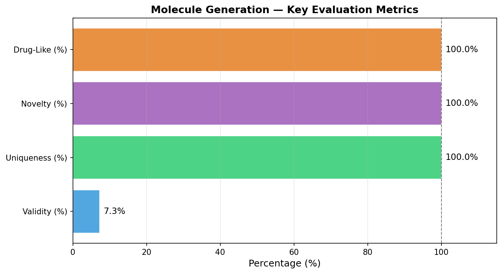
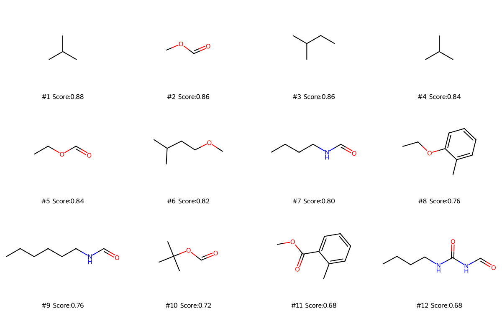
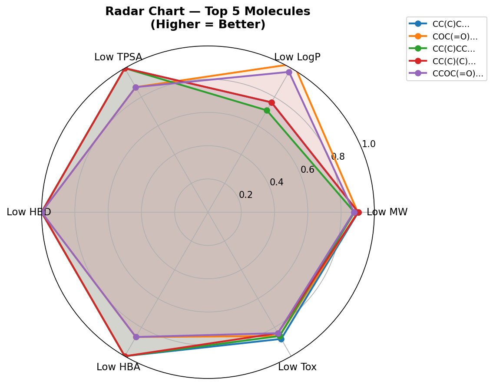
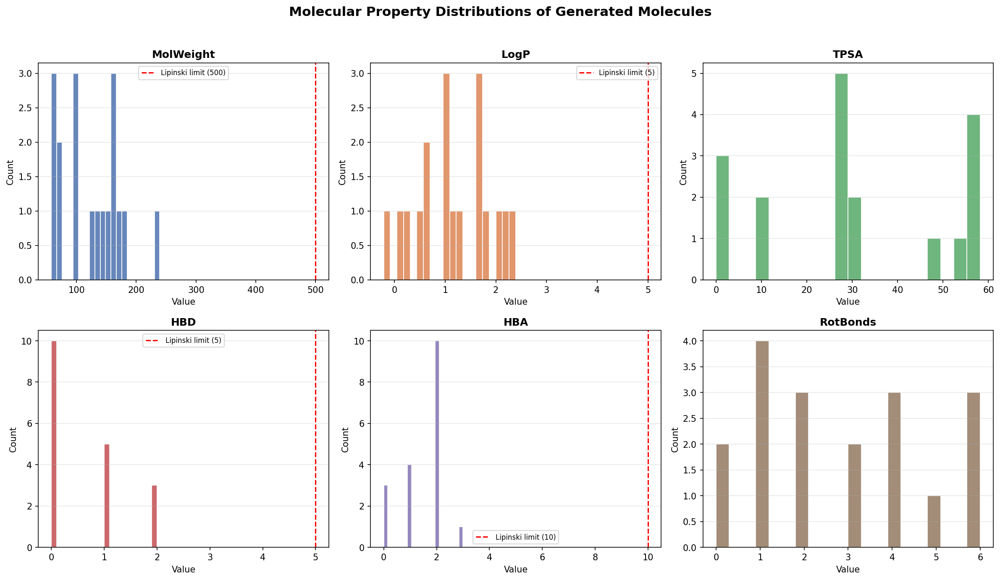
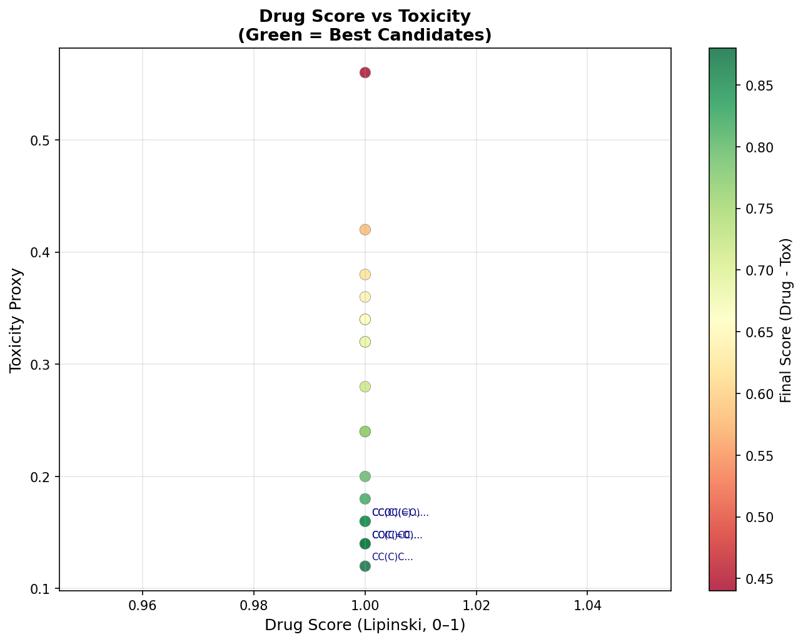
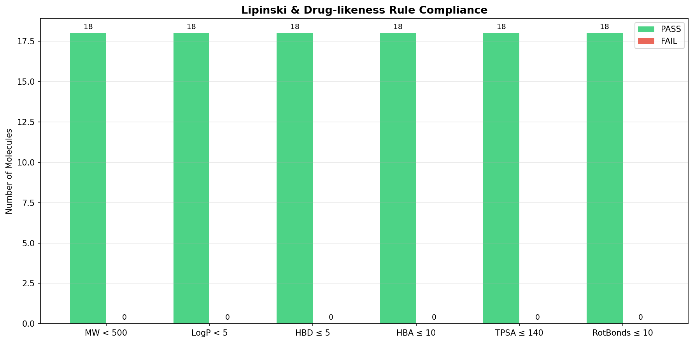
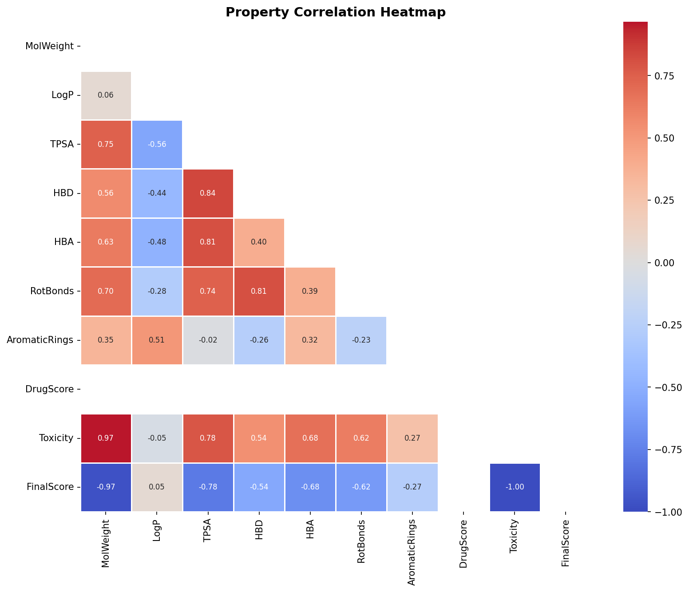
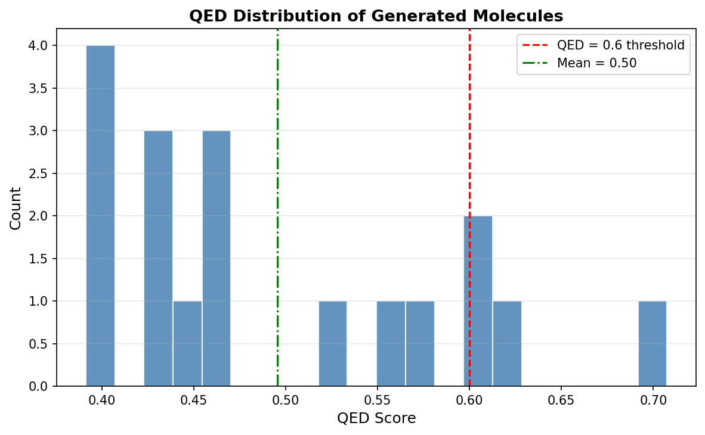

# 🧬 AI-Powered Drug Molecule Generation using LSTM

A deep learning project that leverages **Long Short-Term Memory (LSTM)** neural networks to generate novel drug-like molecules represented as **SMILES** strings. The generated molecules are evaluated for drug-likeness using **Lipinski's Rule of Five**, molecular property analysis, and toxicity scoring.

---

## 📋 Table of Contents
- [Overview](#overview)
- [Project Architecture](#project-architecture)
- [Dataset](#dataset)
- [Model Architecture](#model-architecture)
- [Molecular Evaluation Pipeline](#molecular-evaluation-pipeline)
- [Results](#results)
- [File Structure](#file-structure)
- [How to Run](#how-to-run)
- [Technologies Used](#technologies-used)
- [Research Paper](#research-paper)
- [License](#license)

---

## 🔬 Overview

Drug discovery is a costly and time-consuming process. This project explores the use of **Generative AI** (specifically, character-level LSTM models) to **automatically generate novel molecular structures** that satisfy key drug-likeness criteria. 

The pipeline:
1. Trains an LSTM model on ~250K real drug molecules (ZINC dataset)
2. Generates novel SMILES strings using temperature-controlled sampling
3. Validates molecules using **RDKit**
4. Evaluates molecular properties (MW, LogP, TPSA, HBD, HBA, QED)
5. Ranks molecules by a composite Drug Score minus Toxicity proxy

---

## 🏗️ Project Architecture

```
Input: ZINC250K Dataset (SMILES strings)
         │
         ▼
┌─────────────────────┐
│  Data Preprocessing │  → Tokenize SMILES, character-level encoding
│  & Vocabulary Build │  → Pad sequences to max_len = 30
└─────────────────────┘
         │
         ▼
┌─────────────────────┐
│   LSTM Model        │  → Embedding(64) → LSTM(128) → Dense(softmax)
│   Training          │  → 50 epochs, batch_size=256
└─────────────────────┘
         │
         ▼
┌─────────────────────┐
│  Molecule Generation│  → Temperature sampling (t=0.3)
│  (500 candidates)   │  → Seed characters: CC, CCC, COC, CCO
└─────────────────────┘
         │
         ▼
┌─────────────────────┐
│  Validation &       │  → RDKit SMILES parsing
│  Filtering          │  → Remove invalid, short (<6 chars), duplicates
└─────────────────────┘
         │
         ▼
┌─────────────────────┐
│  Evaluation &       │  → Lipinski's Rule of Five
│  Ranking            │  → Drug Score, Toxicity, QED
└─────────────────────┘
```

---

## 📊 Dataset

- **Name:** ZINC250K (Clean subset)
- **Source:** [Kaggle — ZINC250K](https://www.kaggle.com/datasets/basu369victor/zinc250k)
- **File:** `250k_rndm_zinc_drugs_clean_3.csv`
- **Size:** ~249,455 valid SMILES strings
- **Description:** A curated subset of commercially available drug-like compounds from the ZINC database, widely used in molecular generation research.

---

## 🧠 Model Architecture

| Layer          | Configuration                    |
|:--------------:|:--------------------------------:|
| Embedding      | `input_dim = vocab_size, output_dim = 64` |
| LSTM           | `128 hidden units`               |
| Dense (Output) | `vocab_size, softmax activation` |

- **Loss:** Sparse Categorical Crossentropy
- **Optimizer:** Adam
- **Training:** 50 epochs, 974 steps/epoch
- **Final Training Loss:** ~0.77

The model is saved as `molecule_model.h5`.

---

## 🧪 Molecular Evaluation Pipeline

### Lipinski's Rule of Five (Drug Score)
Each molecule is scored on 4 criteria (max score = 1.0):
- Molecular Weight < 500 Da
- LogP < 5
- Hydrogen Bond Donors ≤ 5
- Hydrogen Bond Acceptors ≤ 10

### Toxicity Proxy
A simple length-based proxy: `toxicity = len(SMILES) / 50`

### Final Score
```
Final Score = Drug Score − Toxicity
```

### Additional Metrics
- **Validity:** Percentage of generated SMILES that parse as valid molecules
- **Uniqueness:** Percentage of unique molecules among generated candidates
- **Novelty:** Percentage of valid molecules not found in the training set
- **QED (Quantitative Estimation of Drug-likeness):** RDKit's built-in drug-likeness score

---

## 📈 Results

### Key Evaluation Metrics
| Metric           | Value   |
|:----------------:|:-------:|
| Validity         | 7.3%    |
| Uniqueness       | 100%    |
| Novelty          | 100%    |
| Avg Drug Score   | 1.0     |
| Drug-Like (%)    | 100%    |
| Avg Toxicity (%) | 27.22%  |

### 🏆 Best Generated Molecule
```
SMILES:      CC(C)C
Drug Score:  1.0
Toxicity:    0.12
Final Score: 0.88
```

### Visualization Results

#### Metrics Dashboard


#### Top 12 Generated Molecules with Scores


#### Radar Chart — Top 5 Molecules


#### Property Distributions


#### Drug Score vs Toxicity


#### Lipinski Compliance


#### Property Correlation Heatmap


#### QED Distribution


---

## 📁 File Structure

```
├── FGAI_Project.ipynb                  # Main Jupyter Notebook (full pipeline)
├── 250k_rndm_zinc_drugs_clean_3.csv    # Training dataset (ZINC250K)
├── molecule_model.h5                   # Trained LSTM model (Keras/HDF5)
├── generated_molecules_full.csv        # Generated molecules with properties
├── metrics_dashboard.png               # Evaluation metrics bar chart
├── top12_molecules.png                 # Top 12 molecules visualization
├── radar_top5.png                      # Radar chart of top 5 molecules
├── property_distributions.png          # Molecular property distributions
├── drug_vs_toxicity.png                # Drug score vs toxicity scatter
├── lipinski_compliance.png             # Lipinski rule compliance chart
├── property_correlation.png            # Property correlation heatmap
├── qed_distribution.png                # QED score distribution
└── README.md                           # This file
```

---

## 🚀 How to Run

### Prerequisites
- Python 3.10+
- Google Colab (recommended) or local environment

### Install Dependencies
```bash
pip install rdkit pandas numpy tensorflow matplotlib seaborn scikit-learn kagglehub
```

### Run the Notebook
1. Open `FGAI_Project.ipynb` in Google Colab or Jupyter Notebook
2. Upload the dataset `250k_rndm_zinc_drugs_clean_3.csv` when prompted
3. Execute all cells sequentially
4. Results (charts, CSV, model) will be generated automatically

---

## 🛠️ Technologies Used

| Technology     | Purpose                               |
|:--------------:|:-------------------------------------:|
| Python         | Core language                         |
| TensorFlow/Keras | LSTM model training & inference     |
| RDKit          | Chemical structure validation & properties |
| Pandas/NumPy   | Data manipulation                     |
| Matplotlib/Seaborn | Visualization & plotting          |
| Google Colab   | Cloud-based GPU execution             |

---

## 📄 Research Paper

The full research paper accompanying this project is included as `FGAI PAPER (1).pdf`.

---

## 📝 License

This project is for academic/educational purposes.

---

**Author:** Kavya Garg  
**Contact:** kavyagarg321@gmail.com
